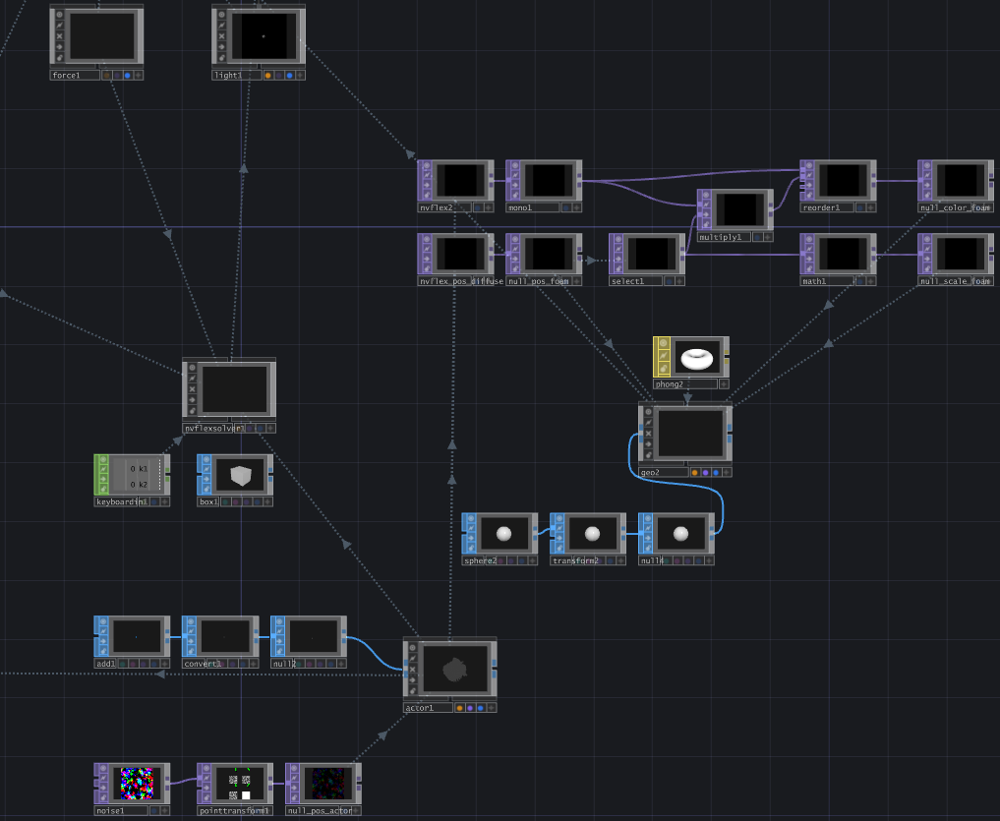

### _Daniel Bartell_

The Reflection Pool Experience allows users to interact'an input, before disrupting the water accordingly. The intended experience allows the user to ‘play’ by kicking some of the water around, creating foamy waves in the process. While not ‘reflecting’ them in the traditional sense, the user sees themselves exclusively through their impact on the environment and the imprint they leave on the space.

