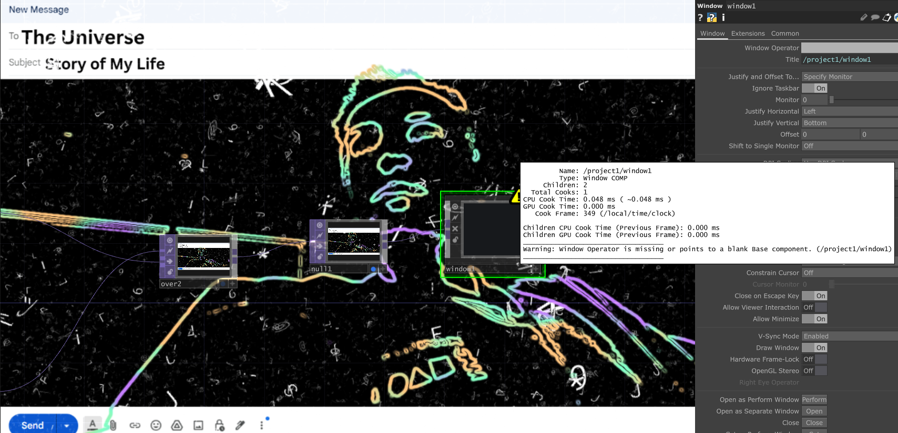
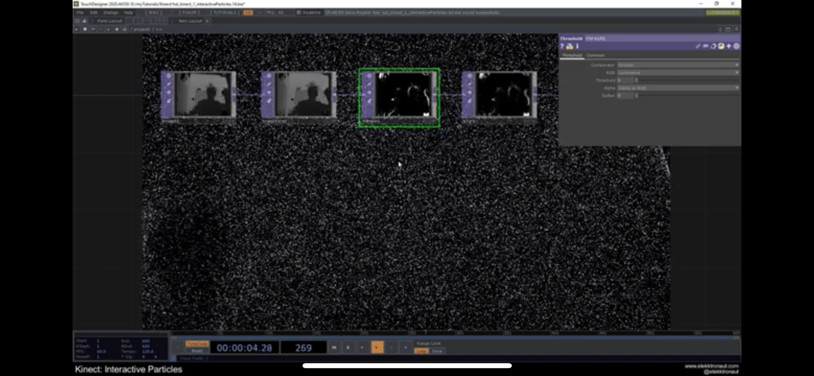
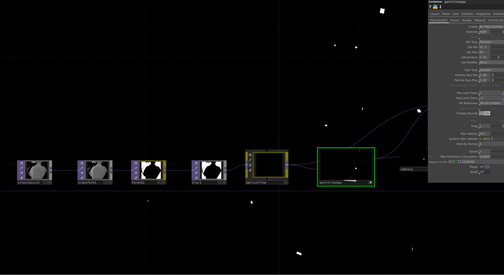
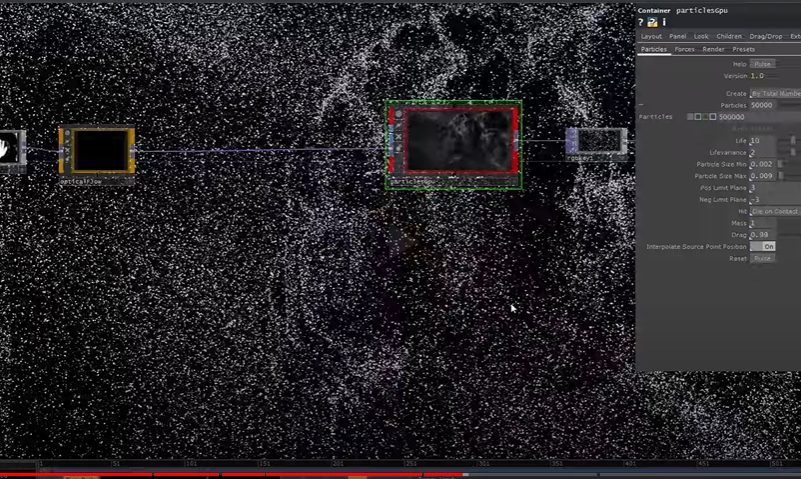
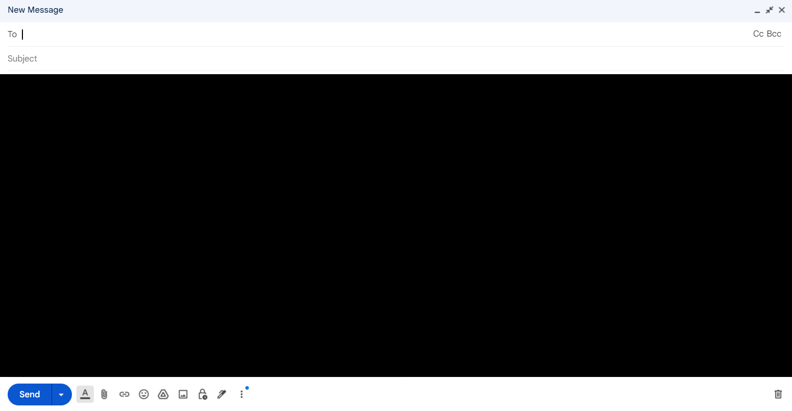
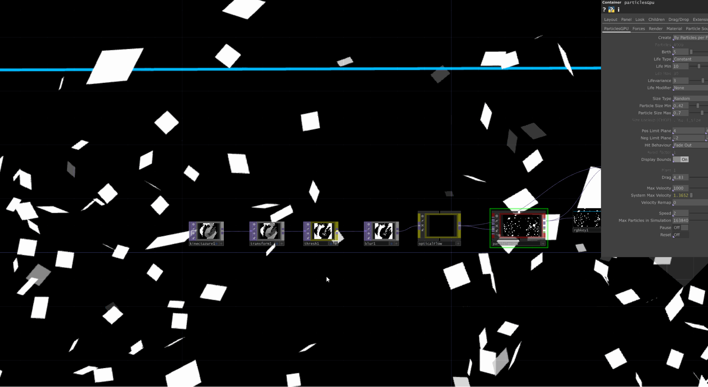

### _Sam Caloiero_

User is in front of a screen and sensor tracking depth and color image. Player’s outline is imposed onto an email draft to “The Universe” with the subject “My Life” on the screen. Inside the contents of the email is a black void filled with floating letters. The player's body movement affects and moves these letters around the void.



