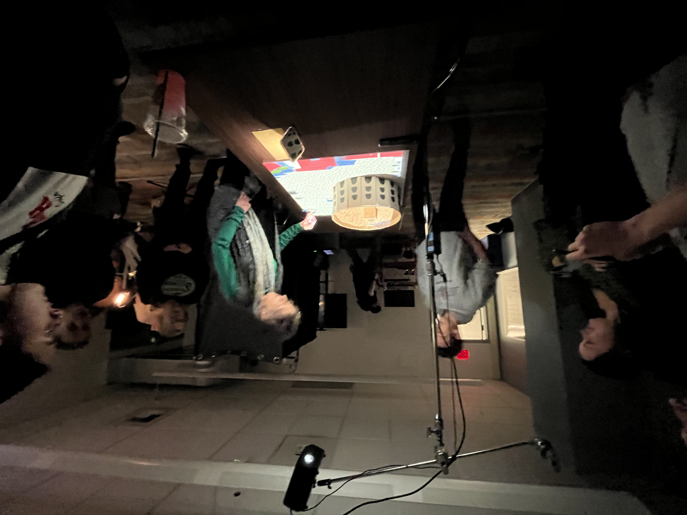
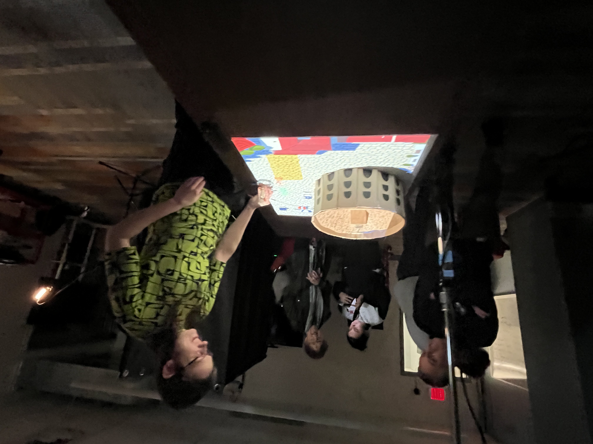
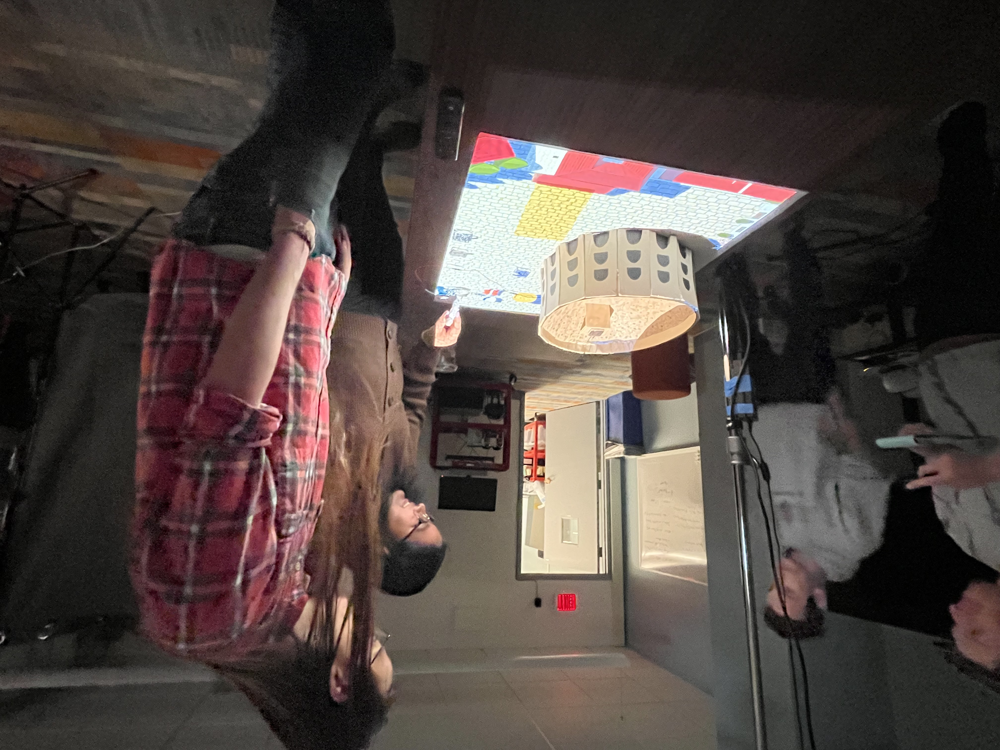
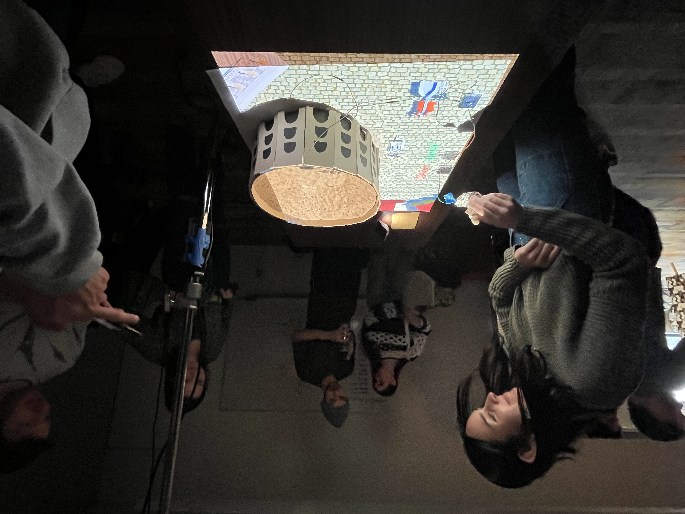

# Evan Alexander, Sam Caloiero, Ryan Kmonk, & Abby Vendura

## _Augmented Colosseum_

 This project is a augmented table top experience of the world-renowned Colosseum in Rome, Italy. You play a average Roman citizen or "plebian" as you witness the process of entering the Colossem, context behind seating, and the decision to allow the defeated gladiator to die or live. You interact with this experience by moving a figurine onto select points to progress the story and decide a final choice at the end.

