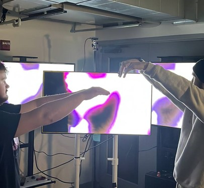
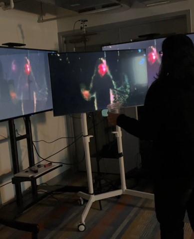
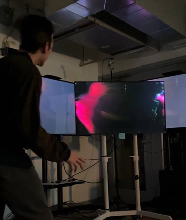
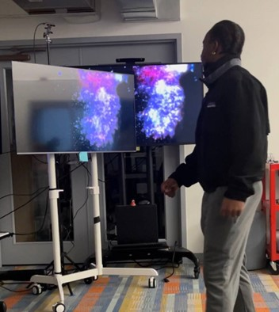
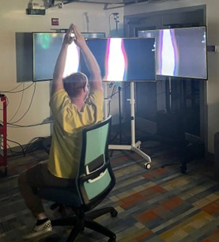

# Korbin Nevius & Evan Alexander

## _A visualizer of yourself as a bunch of particles in space._

User Experience: A real time digital reflection utilizing the Real Sense with Touch Designer. This input is paired with TV monitors as the output. If the player moves to the bounds of the image, the particles that make up the player become distorted and move about the screen. We wanted to encourage the freedom of being able to move however you wanted to within space. As well as to see how you interacted when you see the particles start to become distorted.

