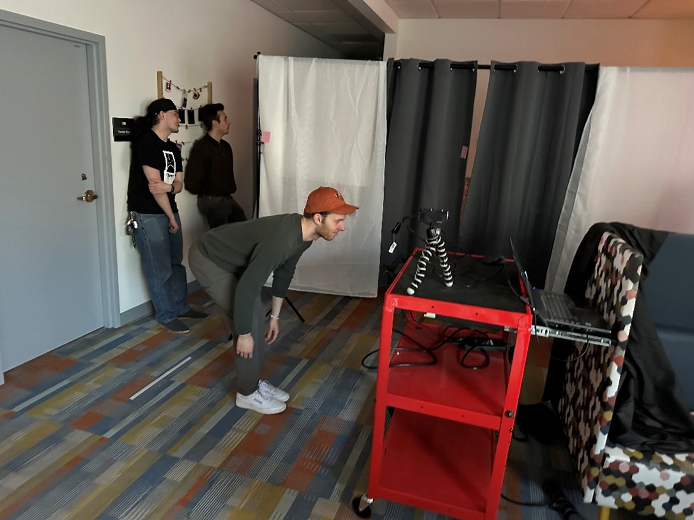
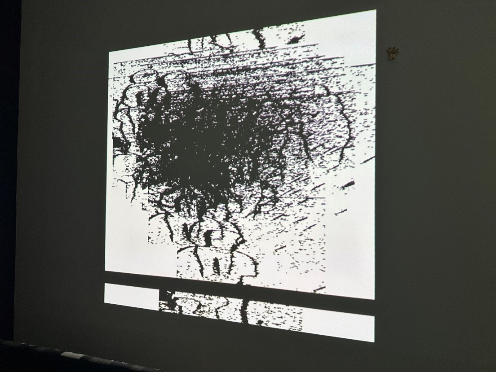
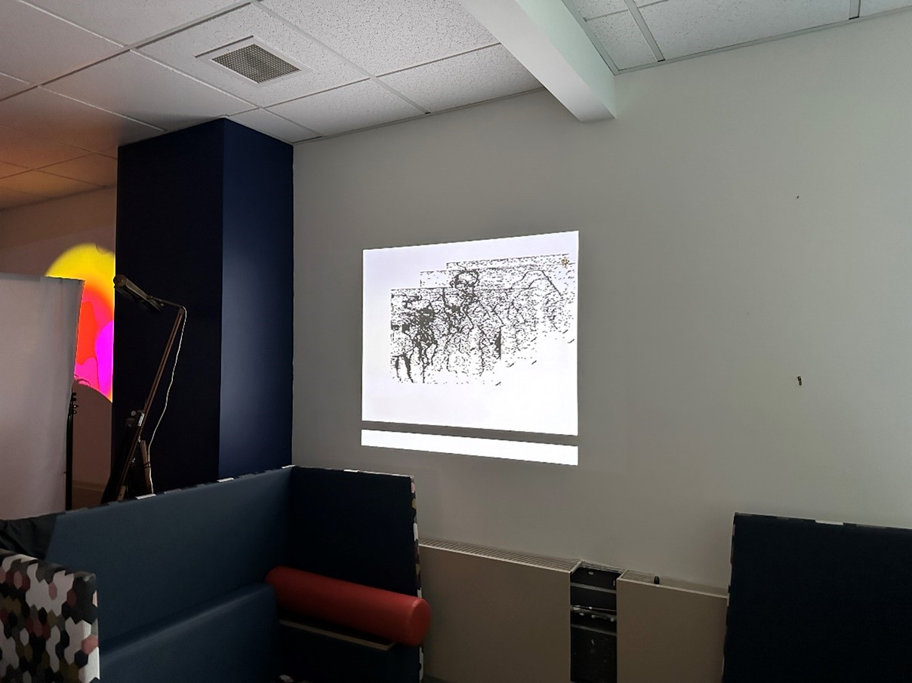
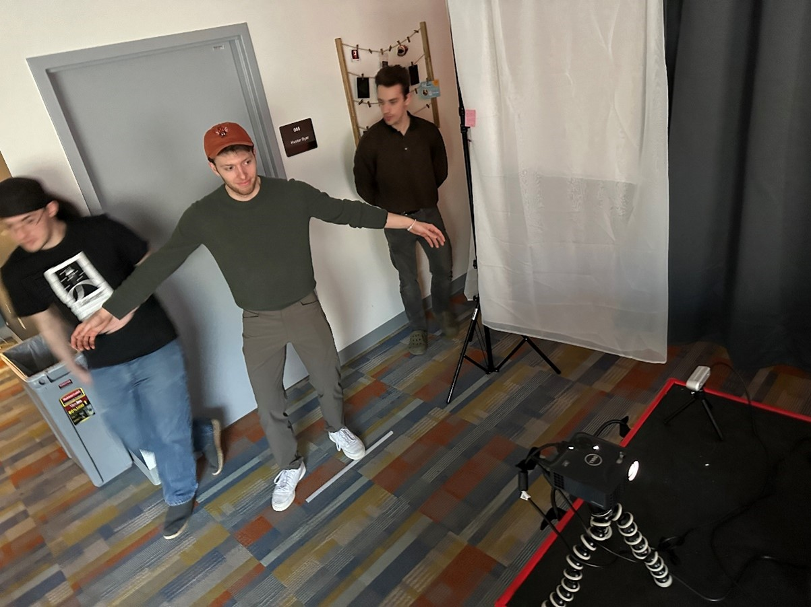
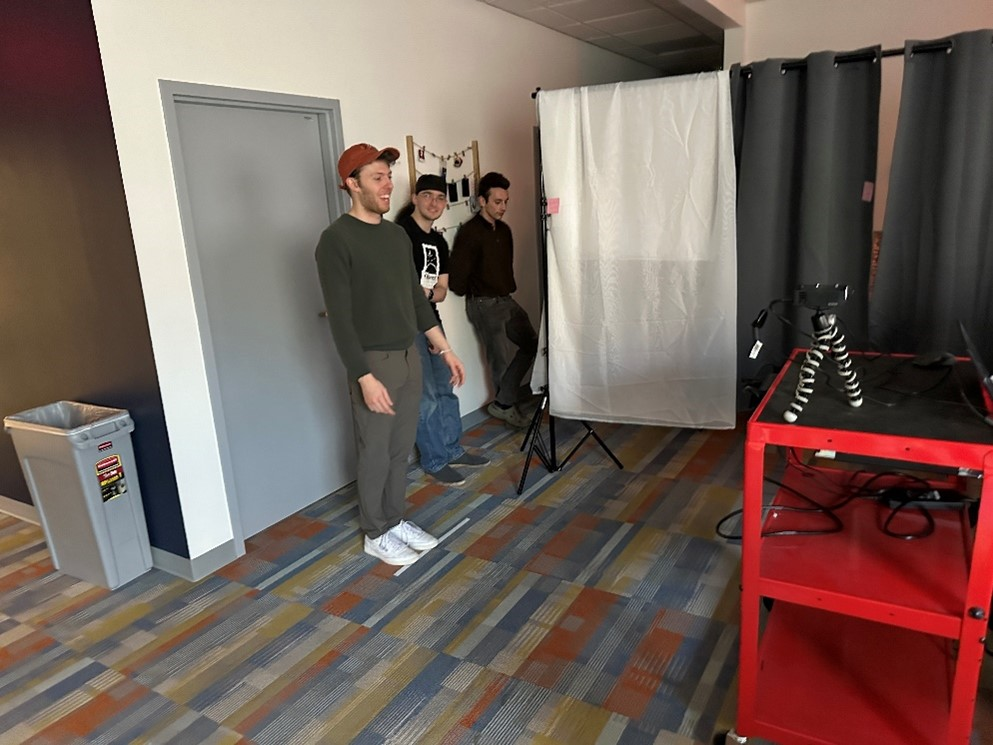
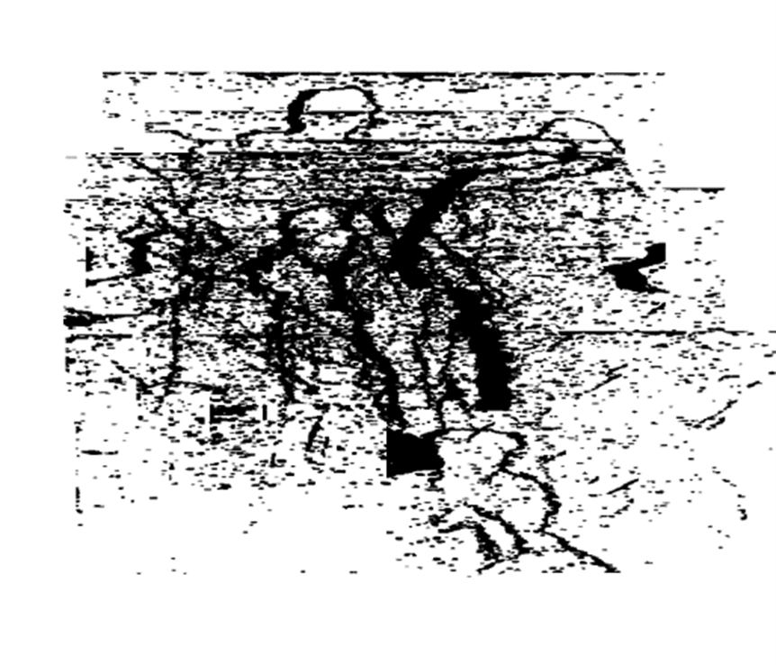
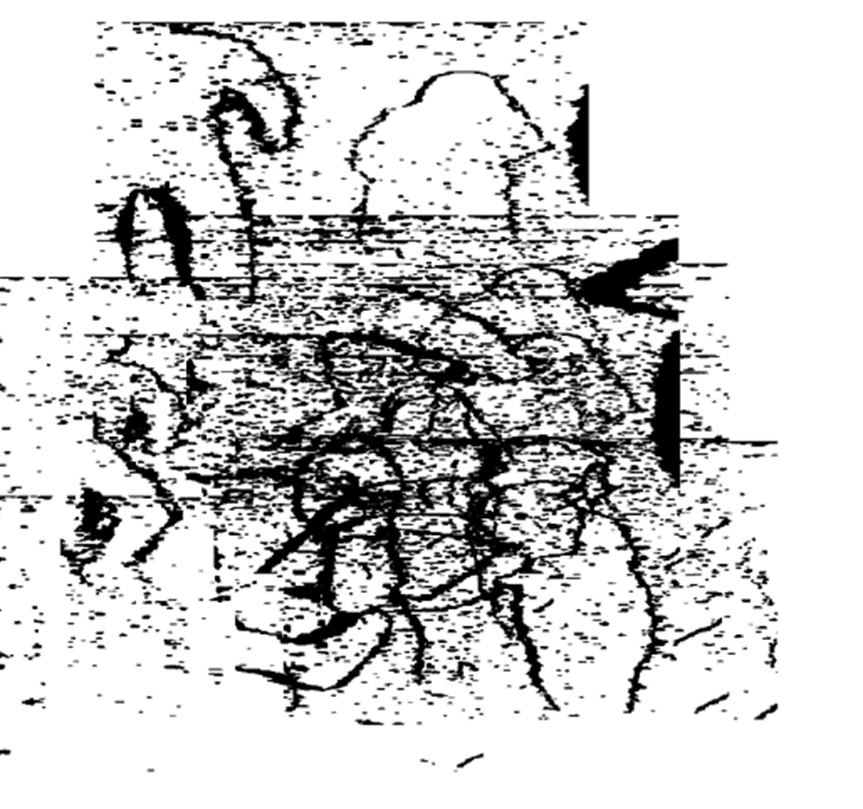

# Lane Macy

## _Progressive Art._

This project greats art by taking outlines of people and positioning them randomly on the canvas. The photos are taken randomly and saved. Photos are then randomly selected to be placed onto the canvas. This means that if left alone for a day, thousands of photos can be taken, and art will be made using all of them,  making infinite unique art pieces. 

